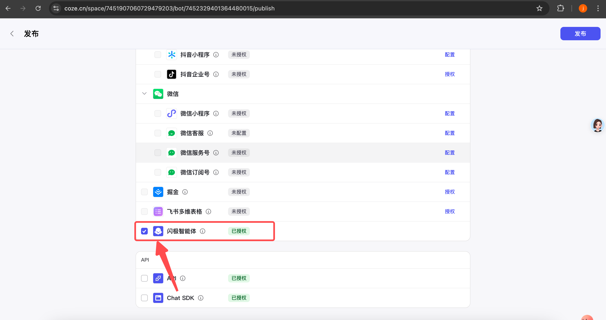

# Coze智能体接入闪极拍拍镜-Oauth JWT(渠道）鉴权

## 目录
- [COZE创建智能体](#1-COZE创建智能体)
    - [手动创建](#手动创建更多信息请参考搭建一个AI智能体)
    - [API构建](#API创建更多信息可参考文档创建智能体API)
- [COZE发布智能体](#2-COZE发布智能体)
    - [手动发布](#手动发布更多信息请参考智能体发布概述)
    - [API发布](#API发布更多信息请参考发布智能体API)
- [闪极拍拍镜中添加智能体](#3闪极拍拍镜中添加智能体)
    - [手动添加](#手动添加) 

## 流程

> [!NOTE]
> **确保自己的COZE账号具备发布智能体到闪极科技智能体团队的权限** 
目前闪极智能体平台尚未成为COZE公共平台（正在申请中），在申请通过之前，只有受邀请的成员才能申请发布自有智能体到闪极智能体平台，您可通过以下方式查看自己是否具备对应的发布权限。
>  - 登陆[**Coze平台**](https://www.coze.cn/home)
>  - 点击页面左侧的工作空间，然后点击**个人空间**查看自己是否在**shargeAI**的团队下

>  
    
>  - 如果您的团队不包含**shargeAI**，您需要向shargeAI团队管理员 (邮箱：zenggangxin@shargetech.com)申请成为团队成员
>  - 如果您的团队中包含**shargeAI**，则您具备对应的发布权限

> [!NOTE]
> 如果已知晓COZE智能体创建及发布的流程，可直接跳到步骤3：[闪极拍拍镜中添加智能体](#3闪极拍拍镜中添加智能体)

### 1. COZE创建智能体

#### 手动创建（更多信息请参考：[搭建一个AI智能体](https://www.coze.cn/docs/guides/agent_quick_start))
>[!NOTE] 
> 需要在**ShargeAI**团队下创建智能体，否则智能体不能发布到**闪极智能体**平台
- 创建一个智能体
    - 登陆[扣子平台](https://www.coze.cn/home)
    - 在页面左上角单击⊕，然后点击创建智能体
     
        
     
- 输入智能体名称、功能介绍等信息，也可以切换到AI构建，通过自然语言描述你的智能体创建需求，扣子会根据描述自动创建一个专属于你的智能体（需要注意的是，**工作空间**需要选择**ShargeAI**，详情请参考文档：[通过AI创建智能体](https://www.coze.cn/docs/guides/assistant_coze#d11d798b)）
   
    
     
- 单击确认。创建智能体后，你会直接进入智能体编排页面。你可以:
    - 在左侧**人设与回复逻辑**面板中描述智能体的身份和任务
    - 在中间**技能**面板为智能体配置各种扩展能力
    - 在右侧**预览与调试**面板中，实时调试智能体

        
    
- 编写提示词
    - 配置智能体的第一步就是编写提示词，也就是智能体的人设与回复逻辑。智能体的人设与回复逻辑定义了智能体的基本人设，此人设会持续影响智能体在所有回话中的回复效果。建议在人设与回复逻辑中指定模型的角色、设计回复的语言风格、限制模型的回答范围，让对话更符合用户预期。你可以单击优化，让大语言模型优化为结构化内容。更多详细信息，参考[编写提示词](https://www.coze.cn/docs/guides/prompt)
  
        
     
- （可选）为智能体添加技能。  如果模型能力可以基本覆盖智能体的功能，则只需要为智能体编写提示词即可。但是如果你为智能体设计的功能无法仅通过模型能力完成，则需要为智能体添加技能，拓展它的能力边界。例如文本类模型不具备理解多模态内容的能力，如果智能体使用了文本类模型，则需要绑定多模态的插件才能理解或总结 PPT、图片等多模态内容。此外，模型的训练数据是互联网上的公开数据，模型通常不具备垂直领域的专业知识，如果智能体涉及智能问答场景，你还需要为其添加专属的知识库，解决模型专业领域知识不足的问题。详情请查看：[为智能体添加技能](https://www.coze.cn/docs/guides/agent_plugin)
- 调试智能体 配置好智能体后，就可以在**预览与调试**区域中测试智能体是否符合预期。
    
    
      
#### API创建（更多信息可参考文档：[创建智能体API](https://www.coze.cn/docs/developer_guides/create_bot))
##### 鉴权
- COZE PAT鉴权(参考：[pat鉴权](../pat_agent/README_zh.md#1-coze-pat鉴权更多信息请参考添加个人访问令牌),更多信息请参考：[添加个人访问令牌](https://www.coze.cn/docs/developer_guides/pat))
- COZE Oauth JWT（开发者）鉴权(参考：[personal oauth jwt](../personal_oauth_jwt/README_zh.md#1-COZE-Oauth-JWT开发者鉴权更多信息请参考OAuth-JWT授权开发者),更多信息请参考：[OAuth JWT授权（开发者）](https://www.coze.cn/docs/developer_guides/oauth_jwt))

##### 接口信息
- **请求方式**：`POST`  
- **请求地址**：[https://api.coze.cn/v1/bot/create](https://api.coze.cn/v1/bot/create)  
- 更多接口参数和示例请参考原文档

### 2. COZE发布智能体
  
#### 手动发布（更多信息请参考：[智能体发布概述](https://www.coze.cn/docs/guides/publish_agent)）
- 创建智能体后，点击右上角发布
  
    
  
- 填写发布记录，选择发布平台时务必选择**闪极智能体**。
  
    
   
#### API发布(更多信息请参考：[发布智能体API](https://www.coze.cn/docs/developer_guides/publish_bot))
##### 鉴权：
- 方式同[鉴权](#鉴权)

##### 接口信息
- **请求方式**：`POST`  
- **请求地址**：[https://api.coze.cn/v1/bot/publish](https://api.coze.cn/v1/bot/publish)  
- 更多接口参数和示例请参考原文档
    
### 3.闪极拍拍镜中添加智能体
  
#### 手动添加
       
- 登陆**闪极APP**
- 在底部导航栏选择**AI**，右上角点击➕号，然后选择**创建智能体**
    
    
- 勾选**COZE**，填入对应配置信息，再点击**创建智能体**。  至此，你的智能体已经成功接入，可在闪极拍拍镜中通过说：“找【智能体名称】”，可以唤醒对应的智能体并与它交互。
