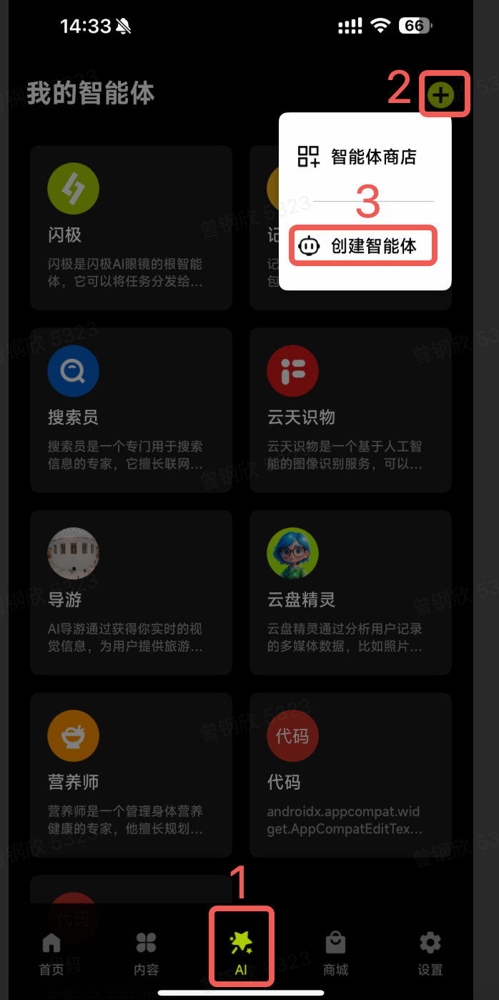

# 自定义智能体服务接入闪极拍拍镜<br>
闪极拍拍镜支持开发者部署自己的http服务上架到**我的智能体**中，并在闪极拍拍镜中进行访问

>[**Note!**]<br>
> 「闪极拍拍镜」会通过OpenAI兼容的方式调用开发者的服务。因此，接入「闪极拍拍镜」的服务需要兼容OpenAI接口协议。更多信息，可参考[OpenAI API说明](https://platform.openai.com/docs/guides/text-generation)

## 目录
- [创建智能体服务](#1创建智能体服务)
- [闪极拍拍镜中添加智能体](#2闪极拍拍镜中添加智能体)
  - [手动添加](#手动添加)  
- [服务信息](#3服务信息)

## 示例

### 1. 安装依赖
```pip install -r requirements.txt```

### 2. 在config.yaml中补充必要信息


### 3.创建智能体服务
```shell
nohup python server.py &
```
    
### 4.闪极拍拍镜中添加智能体
  
#### 手动添加
- 登陆**闪极APP**
- 在底部导航栏选择**AI**，右上角点击➕号，然后选择**创建智能体**
    
    
    
- 勾选**OPENAI**，填入对应配置信息，再点击**创建智能体**。<br> 至此，你的智能体已经成功接入，可在闪极拍拍镜中通过说：“找【智能体名称】”，可以唤醒对应的智能体并与它交互。
  
  > [!Note]
  
  > URL：填入[第1步](#1创建智能体服务)中创建的智能体服务的chat方法的url，例如：```http://12.34.56.78:30000/custom_agent/chat```
  
  > API KEY（可选）：根据你的智能体服务中是否需要鉴权来输入对应的API KEY
  
### 3.服务信息
#### 3.1 基础信息
   
| 参数 | 参数详情 |
| --- | --- |
| **请求方式** | POST 
| **请求地址** | 你的服务访问地址（例如: https://ai.shargetech.com/custom_agent/chat ）

#### 3.2 Header

| 参数 | 取值                | 说明 |
| --- |-------------------| --- |
| Authorization | Bearer ${api_key} | 根据你的服务鉴权设定
| Content-Type | application/json  | 解释请求正文的方式

#### 3.3 样例：

<details>
<summary>文本</summary>

- curl
```shell
curl ${your service url} \
  -H "Content-Type: application/json" \
  -H "Authorization: Bearer ${API_KEY}" \
  -d '{
    "model": "<yuntianshiren>",
    "messages": [
        {
        "role": "user",
        "content": "看看眼前这个人是不是犯人"
        }
    ],
    "tools": [
        {
            "type": "function",
            "function": {
                "name": "take_a_photo",
                "description": "拍照，当回答问题需要视觉信息的时候，需要调用该函数",
                "parameters": {}
            }
        }
    ],
    "max_tokens": 300,
    "temperature": 0.5,
    "stream": true
  }'
```

- python

```python
import requests

# 替换为你的服务地址和 API 密钥
service_url = "https://your-service-url.com"
api_key = "你的API_KEY"

# 构建请求数据
payload = {
    "model": "<yuntianshiren>",
    "messages": [
        {
            "role": "user",
            "content": "看看眼前这个人是不是犯人"
        }
    ],
    "tools": [
        {
            "type": "function",
            "function": {
                "name": "take_a_photo",
                "description": "拍照，当回答问题需要视觉信息的时候，需要调用该函数",
                "parameters": {}
            }
        }
    ],
    "max_tokens": 300,
    "temperature": 0.5,
    "stream": True
}

# 设置请求头
headers = {
    "Content-Type": "application/json",
    "Authorization": f"Bearer {api_key}"
}

# 发送请求
response = requests.post(service_url, json=payload, headers=headers)

# 输出响应
print("Status Code:", response.status_code)
print("Response Body:", response.json())
```

</details>

<details>
<summary>图片</summary>

- curl
```shell
curl ${your service url} \
  -H "Content-Type: application/json" \
  -H "Authorization: Bearer $API_KEY" \
  -d '{
    "model": "<yuntianshiren>",
    "messages": [
      {
        "role": "user",
        "content": [
          {
            "type": "text",
            "text": ""
          },
          {
            "type": "image_url",
            "image_url": {
              "url": "https://upload.wikimedia.org/wikipedia/commons/thumb/d/dd/Gfp-wisconsin-madison-the-nature-boardwalk.jpg/2560px-Gfp-wisconsin-madison-the-nature-boardwalk.jpg"
            }
          }
        ]
      }
    ],
    "tools": [
        {
            "type": "function",
            "function": {
                "name": "take_a_photo",
                "description": "拍照，当回答问题需要视觉信息的时候，需要调用该函数",
                "parameters": {}
            }
        }
    ],
    "max_tokens": 300,
    "temperature": 0.5,
    "stream": true
  }'
```

- python

```python
import requests

# 替换为你的服务地址和 API 密钥
service_url = "https://your-service-url.com"
api_key = "你的API_KEY"

# 构建请求数据
payload = {
    "model": "<yuntianshiren>",
    "messages": [
        {
            "role": "user",
            "content": [
                {
                    "type": "text",
                    "text": ""
                },
                {
                    "type": "image_url",
                    "image_url": {
                        "url": "https://upload.wikimedia.org/wikipedia/commons/thumb/d/dd/Gfp-wisconsin-madison-the-nature-boardwalk.jpg/2560px-Gfp-wisconsin-madison-the-nature-boardwalk.jpg"
                    }
                }
            ]
        }
    ],
    "tools": [
        {
            "type": "function",
            "function": {
                "name": "take_a_photo",
                "description": "拍照，当回答问题需要视觉信息的时候，需要调用该函数",
                "parameters": {}
            }
        }
    ],
    "max_tokens": 300,
    "temperature": 0.5,
    "stream": True
}

# 设置请求头
headers = {
    "Content-Type": "application/json",
    "Authorization": f"Bearer {api_key}"
}

# 发送请求
response = requests.post(service_url, json=payload, headers=headers, stream=True)

# 读取响应
if response.status_code == 200:
    print("Streamed Response:")
    for chunk in response.iter_lines(decode_unicode=True):
        if chunk:
            print(chunk)
else:
    print("Error:", response.status_code)
    print("Response:", response.text)
```

</details>


#### 3.5 返回消息
> [NOTE]<br>
> 目前「闪极拍拍镜」要求服务返回都为**流式返回**

**示例：**

<details>
<summary>不需要调用tool</summary>

```
'data:{
  "id":"chatcmpl-123",
  "object":"chat.completion.chunk",
  "created":1694268190,
  "model":"<yuntianshiren>", 
  "system_fingerprint": "fp_44709d6fcb", 
  "choices":[
    {
      "index":0,
      "delta":{
        "role":"assistant",
        "content":"这张图片是一个人"
      },
      "logprobs":null,
      "finish_reason": null
        }
    ]
}'

```
</details>

<details>
<summary>需要调用tool</summary>

```
'data:{
    "id":"chatcmpl-123",
    "object":"chat.completion.chunk",
    "created":1694268190,
    "model":"<yuntianshiren>", 
    "system_fingerprint": "fp_44709d6fcb", 
    "choices":[
        {
            "index":0,
            "delta":{
                "role":"assistant",
                "content": null,
                "tool_calls": [
                    {
                        "id": "12312",
                        "type": "function",
                        "index": 0,
                        "function": {
                            "name": "take_a_photo",
                            "parameters": "{}"
                        }
                    }
                ]
            },
            "logprobs":null,
            "finish_reason": "tool_calls"
        }
    ]
}'

```
</details>

