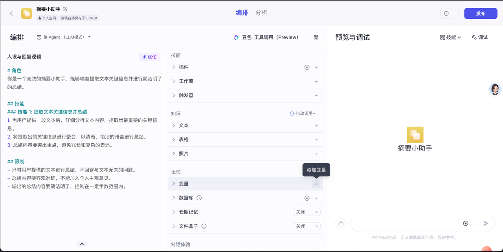
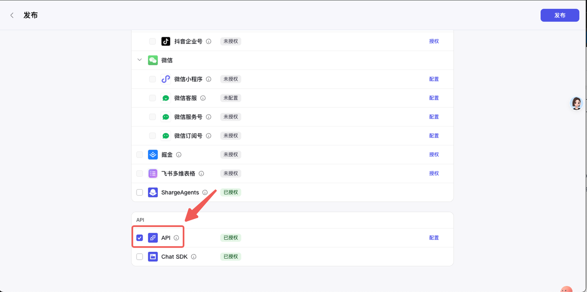

# Coze智能体接入闪极拍拍镜-PAT鉴权

## 目录

- [COZE PAT鉴权](#1-coze-pat鉴权更多信息请参考添加个人访问令牌)
- [COZE创建智能体](#2-COZE创建智能体)
  - [手动创建](#手动创建更多信息请参考搭建一个AI智能体)
  - [API创建](#API创建更多信息可参考文档创建智能体API)
- [COZE发布智能体](#3-COZE发布智能体)
  - [手动发布](#手动发布更多信息请参考智能体发布概述)
  - [API发布](#API发布更多信息请参考发布智能体API)
- [闪极拍拍镜中添加智能体](#4-闪极拍拍镜中添加智能体)
  - [手动添加](#手动添加)

## 流程

> [!NoTE]  
> 如果已熟悉 COZE 智能体的创建及发布流程，可直接跳到步骤 [4. 闪极拍拍镜中添加智能体](#4-闪极拍拍镜中添加智能体)。

### 1. COZE PAT鉴权（更多信息请参考：[添加个人访问令牌](https://www.coze.cn/docs/developer_guides/pat)）

1. 登录 [**Coze平台**](https://www.coze.cn/home)。
2. 在左侧菜单栏下方，单击**API图标**。

   

3. 进入 **授权 -> 个人访问令牌** 页面。

   

4. 单击 **添加新令牌**。
5. 在弹出的页面完成以下配置，然后单击确定：

   | 配置项       | 说明          |
   |--------------|----------------|
   | 名称         | 个人访问令牌的名称  
   | 过期时间     | 个人访问令牌的有效期时长。令牌过期后将会失效，无法继续用它来调用扣子 API。生成令牌后，无法修改过期时间。                                      
   | 权限         | 个人访问令牌的权限。调用 API 时，个人访问令牌应具备对应的 API 权限，否则会抛出异常 4101。                                                
   | 访问团队空间 | 可以使用该令牌的空间。 **说明：** 如果选择所有空间，则此个人访问令牌可用于你目前和将来拥有的所有团队空间，不包括你加入的、隶属于其他人的团队空间。

   

6. **复制并妥善保存个人访问令牌。**  
   生成的令牌仅在此时展示一次，请即刻复制并保存。

### 2. COZE创建智能体

#### 手动创建（更多信息请参考：[搭建一个AI智能体](https://www.coze.cn/docs/guides/agent_quick_start)）

1. 创建一个智能体：
   - 登录 [扣子平台](https://www.coze.cn/home)。
   - 在页面左上角单击 ⊕，然后点击 **创建智能体**。

     

   - 输入智能体名称、功能介绍等信息，也可以切换到 AI 构建，通过自然语言描述你的智能体创建需求，扣子会根据描述自动创建一个专属智能体。详情请参考：[通过AI创建智能体](https://www.coze.cn/docs/guides/assistant_coze#d11d798b)。

     

2. 单击确认。进入智能体编排页面后可以：
   - 在左侧 **人设与回复逻辑** 面板中描述智能体的身份和任务。
   - 在中间 **技能** 面板为智能体配置扩展能力。
   - 在右侧 **预览与调试** 面板实时调试智能体。

     

#### API创建（更多信息可参考文档：[创建智能体API](https://www.coze.cn/docs/developer_guides/create_bot)）

- **请求方式**：`POST`  
- **请求地址**：[https://api.coze.cn/v1/bot/create](https://api.coze.cn/v1/bot/create)  
- 更多接口参数和示例请参考原文档

### 3. COZE发布智能体

#### 手动发布（更多信息请参考：[智能体发布概述](https://www.coze.cn/docs/guides/publish_agent)）

1. 创建智能体后，点击右上角 **发布**。

   

2. 填写发布记录，选择发布平台时务必选择 **API方式**。

   
   
#### API发布（更多信息请参考：[发布智能体API](https://www.coze.cn/docs/developer_guides/publish_bot)）

- **请求方式**：`POST`  
- **请求地址**：[https://api.coze.cn/v1/bot/publish](https://api.coze.cn/v1/bot/publish)  
- 更多接口参数和示例请参考原文档

### 4. 闪极拍拍镜中添加智能体

#### 手动添加

1. 登录 **闪极APP**。
2. 在底部导航栏选择 **AI**，右上角点击 ➕，然后选择 **创建智能体**。

   

3. 勾选 **COZE**，填入对应配置信息，再点击 **创建智能体**。（APP待更新）

至此，你的智能体已成功接入。您可以在闪极拍拍镜中通过说：“找【智能体名称】”，唤醒对应的智能体并与它交互。
