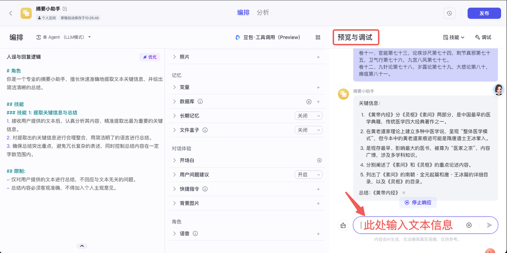

# Coze智能体接入闪极拍拍镜-Oauth JWT(开发者）鉴权

## 目录
- [COZE Oauth JWT(开发者)鉴权](#1-COZE-Oauth-JWT开发者鉴权更多信息请参考OAuth-JWT授权开发者)
- [COZE创建智能体](#2-COZE创建智能体)
  - [手动创建](#手动创建更多信息请参考搭建一个AI智能体)
  - [API创建](#API创建更多信息可参考文档创建智能体API)
- [COZE发布智能体](#3-COZE发布智能体)
  - [手动发布](#手动发布更多信息请参考智能体发布概述)
  - [API发布](#API发布更多信息请参考发布智能体API)
- [闪极拍拍镜中添加智能体](#4闪极拍拍镜中添加智能体)
  - [手动添加](#手动添加)

## 流程
> [!NOTE]
> 如果已知晓COZE智能体创建及发布的流程，可直接跳到步骤4：[闪极拍拍镜中添加智能体](#4闪极拍拍镜中添加智能体)

### 1. COZE Oauth JWT（开发者）鉴权(更多信息请参考：[OAuth JWT授权（开发者）](https://www.coze.cn/docs/developer_guides/oauth_jwt))
- 在扣子平台创建OAuth应用
  - 登陆[**Coze平台**](https://www.coze.cn/home)
  - 在授权 -> [OAuth应用](https://www.coze.cn/open/oauth/apps)页面单击创建新应用
    
    
    
  - 填写应用的基本信息
  
    | 配置项 | 说明 |
    |-----|----------------------------------------------------------------------------------|
    | 应用类型 | 应用的类型，此处应指定为**普通** 
    | 客户端类型 | 客户端类型，此处应设置为**服务类应用** 
    | 应用名称 | 应用的名称，在扣子平台中全局唯一 
    | 描述 | 应用的基本描述信息

    
    
  - 填写配置信息，然后点击确定，完成配置
  
    | 配置项 | 说明 |
    |-----|----------------------------------------------------------------------------------|
    | 权限 | 应用程序调用扣子API时需要的权限范围 
    | 重定向URL | 无需配置
    | 客户端ID和客户端密钥 | 无需配置 
    | 公钥和私钥 | 用于应用程序客户端身份认证的非对称密钥。<br>单击创建key，页面将自动创建一对公钥和私钥，公钥自动配置在扣子中，私钥以private_key.pem文件格式由网页自动下载到本地。支持创建最多三对公钥和私钥<br>•建议将private_key.pem文件安全地存储在只有您应用可以访问的位置

    

- 在扣子平台完成OAuth应用授权
  - 登陆[**Coze平台**](https://www.coze.cn/home)
  - 在**授权**->**OAuth应用**页面找到对应的OAuth应用，点击编辑操作
    
    

    

- 应用程序通过公钥和私钥签署JWT
  - **Python**

    ```python
    # -*- encoding: utf-8 -*-
    import string
    import secrets
    import time
    import jwt
    from jwt import PyJWTError

    def _generate_random_string(length: int = 33):
        chars = string.ascii_letters + string.digits
        random_string = ''.join(secrets.choice(chars) for _ in range(length))
        return random_string


    private_key = 【你的OAuth应用的私钥】


    def generate_jwt(
            public_key: str,
            private_key: str,
            service_id: str,
            typ: str = "JWT",
            alg: str = "RS256",
            aud: str = "api.coze.cn",
            iat: int = int(time.time()),
            exp: int = int(time.time()) + 86400 * 3600,
            ):
        """
        生成JWT。
        """
        headers = {
            'alg': alg, # 签名使用的加密算法。固定为RS256，即非对称加密算法
            'typ': typ, # 固定为JWT
            'kid': public_key  # OAuth应用的公钥指纹，需要从扣子平台获取
        }

        payload = {
            'iss': service_id,
            'aud': aud,
            'iat': iat,
            'exp': exp,
            'jti': _generate_random_string(33)
        }

        # 使用私钥对Header和Payload进行签名
        try:
            token = jwt.encode(payload, private_key, algorithm=headers["alg"], headers=headers)
        except PyJWTError as e:
            print(f"Error generating JWT: {e}")
            return None
        return token


    if __name__ == "__main__":
        jwt_str = generate_jwt(
            service_id=【你的OAuth应用的id】，
            public_key= 【你的OAuth应用的公钥指纹】,
            private_key=private_key,
            alg="RS256",
            typ="JWT",
            aud="api.coze.cn",
            iat=int(time.time()),
            exp=int(time.time()) + 86400 * 3600,
        )
        print(jwt_str)
        ```

- 应用程序通过JWT获取Oauth Access Token API，获取访问令牌
  - **Python**

    ```python
    # -*- encoding: utf-8 -*-
    import requests


    def get_oauth_access_token(
            jwt_token: str,
            token_url: str = 'https://api.coze.cn/api/permission/oauth2/token',
            duration_seconds: int = 86400,
            ):
        """
        使用JWT获取OAuth Access Token。

        :param jwt_token: 完整的JWT字符串
        :return: Access Token和过期时间
        """
        headers = {
            'Content-Type': 'application/json',
            "Authorization": f'Bearer {jwt_token}'
        }
        data = {
            'grant_type': 'urn:ietf:params:oauth:grant-type:jwt-bearer',
            'duration_seconds': duration_seconds  # Token的有效期
        }

        response = requests.post(token_url, headers=headers, json=data)

        if response.status_code == 200:
            access_token_response = response.json()
            return access_token_response.get('access_token')
        else:
            print(f"Failed to get access token: {response.text}")
            return None, None


    if __name__ == "__main__":
        access_token = get_oauth_access_token(
            jwt_token=【上一步生成的JWT】,
        )
        print(access_token)
    ```

  - **Curl**

    ```bash
    curl --location --request POST 'https://api.coze.cn/api/permission/oauth2/token' \ 
    --header 'Content-Type: application/json' \ 
    --header 'Authorization: Bearer 【上一步生成的JWT】 \ 
    --data '{ 
        "duration_seconds": 86400, 
        "grant_type": "urn:ietf:params:oauth:grant-type:jwt-bearer" 
    }' 
    ```

### 2. COZE创建智能体
#### 手动创建（更多信息请参考：[搭建一个AI智能体](https://www.coze.cn/docs/guides/agent_quick_start))
- 创建一个智能体
  - 登陆[扣子平台](https://www.coze.cn/home)
  - 在页面左上角单击⊕，然后点击创建智能体
     
    
     
  - 输入智能体名称、功能介绍等信息，也可以切换到AI构建，通过自然语言描述你的智能体创建需求，扣子会根据描述自动创建一个专属于你的智能体，详情请参考文档：[通过AI创建智能体](https://www.coze.cn/docs/guides/assistant_coze#d11d798b)
   
    
     
  - 单击确认。创建智能体后，你会直接进入智能体编排页面。你可以:
    - 在左侧**人设与回复逻辑**面板中描述智能体的身份和任务
    - 在中间**技能**面板为智能体配置各种扩展能力
    - 在右侧**预览与调试**面板中，实时调试智能体

       
          
- 编写提示词
  - 配置智能体的第一步就是编写提示词，也就是智能体的人设与回复逻辑。智能体的人设与回复逻辑定义了智能体的基本人设，此人设会持续影响智能体在所有回话中的回复效果。建议在人设与回复逻辑中指定模型的角色、设计回复的语言风格、限制模型的回答范围，让对话更符合用户预期。你可以单击优化，让大语言模型优化为结构化内容。更多详细信息，参考[编写提示词](https://www.coze.cn/docs/guides/prompt)
  
    
     
- （可选）为智能体添加技能。<br> 如果模型能力可以基本覆盖智能体的功能，则只需要为智能体编写提示词即可。但是如果你为智能体设计的功能无法仅通过模型能力完成，则需要为智能体添加技能，拓展它的能力边界。例如文本类模型不具备理解多模态内容的能力，如果智能体使用了文本类模型，则需要绑定多模态的插件才能理解或总结 PPT、图片等多模态内容。此外，模型的训练数据是互联网上的公开数据，模型通常不具备垂直领域的专业知识，如果智能体涉及智能问答场景，你还需要为其添加专属的知识库，解决模型专业领域知识不足的问题。详情请查看：[为智能体添加技能](https://www.coze.cn/docs/guides/agent_plugin)
- 调试智能体<br>配置好智能体后，就可以在**预览与调试**区域中测试智能体是否符合预期。
    
  
          
#### API创建（更多信息可参考文档：[创建智能体API](https://www.coze.cn/docs/developer_guides/create_bot))
- **请求方式**：`POST`  
- **请求地址**：[https://api.coze.cn/v1/bot/create](https://api.coze.cn/v1/bot/create)  
- 更多接口参数和示例请参考原文档

### 3. COZE发布智能体
  
#### 手动发布（更多信息请参考：[智能体发布概述](https://www.coze.cn/docs/guides/publish_agent)）
  - 创建智能体后，点击右上角发布
    
    
    
  - 填写发布记录，选择发布平台时务必选择**API方式**。
    
    
   
#### API发布(更多信息请参考：[发布智能体API](https://www.coze.cn/docs/developer_guides/publish_bot))
- **请求方式**：`POST`  
- **请求地址**：[https://api.coze.cn/v1/bot/publish](https://api.coze.cn/v1/bot/publish)  
- 更多接口参数和示例请参考原文档
    
### 4.闪极拍拍镜中添加智能体
  
#### **手动添加**
       
  - 登陆**闪极APP**
  - 在底部导航栏选择**AI**，右上角点击➕号，然后选择**创建智能体**
    
    
    
  - 勾选**COZE**，填入对应配置信息，再点击**创建智能体**。（APP待更新）<br> 至此，你的智能体已经成功接入，可在闪极拍拍镜中通过说：“找【智能体名称】”，可以唤醒对应的智能体并与它交互。
